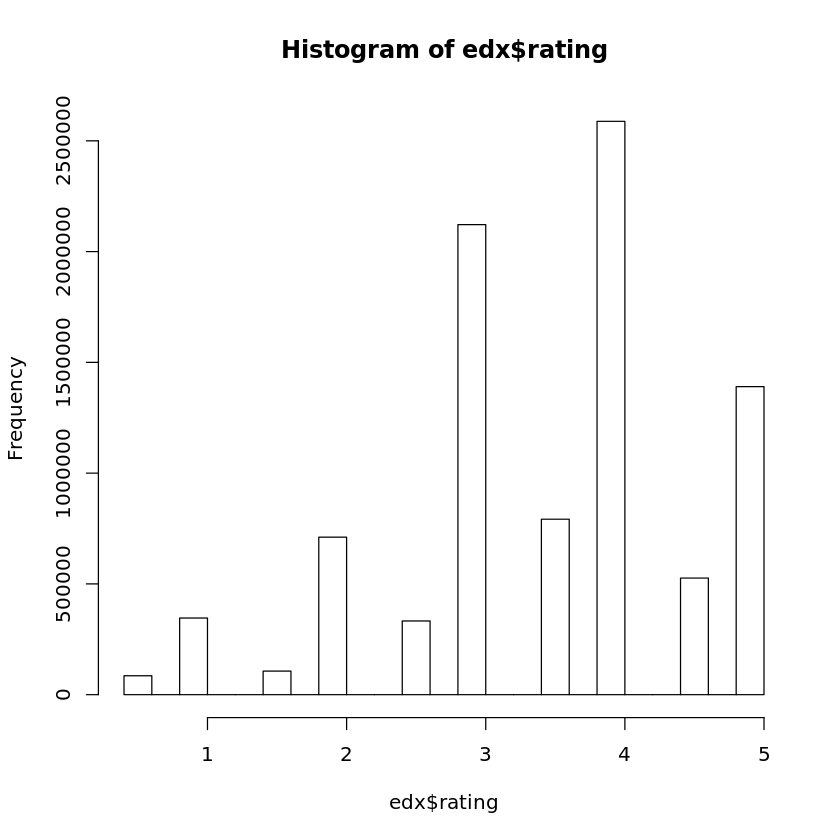
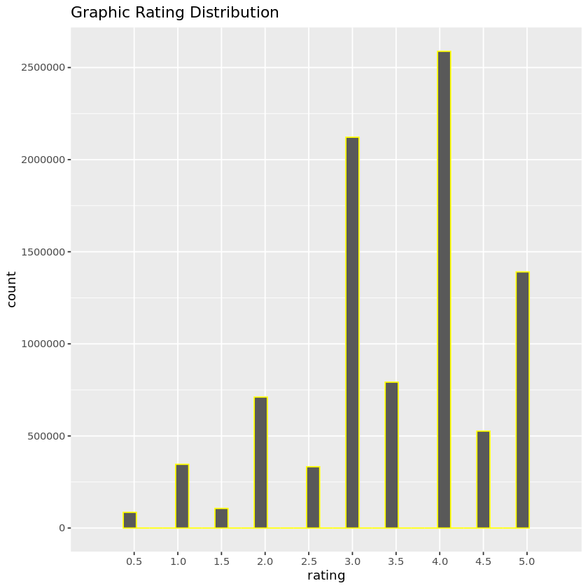
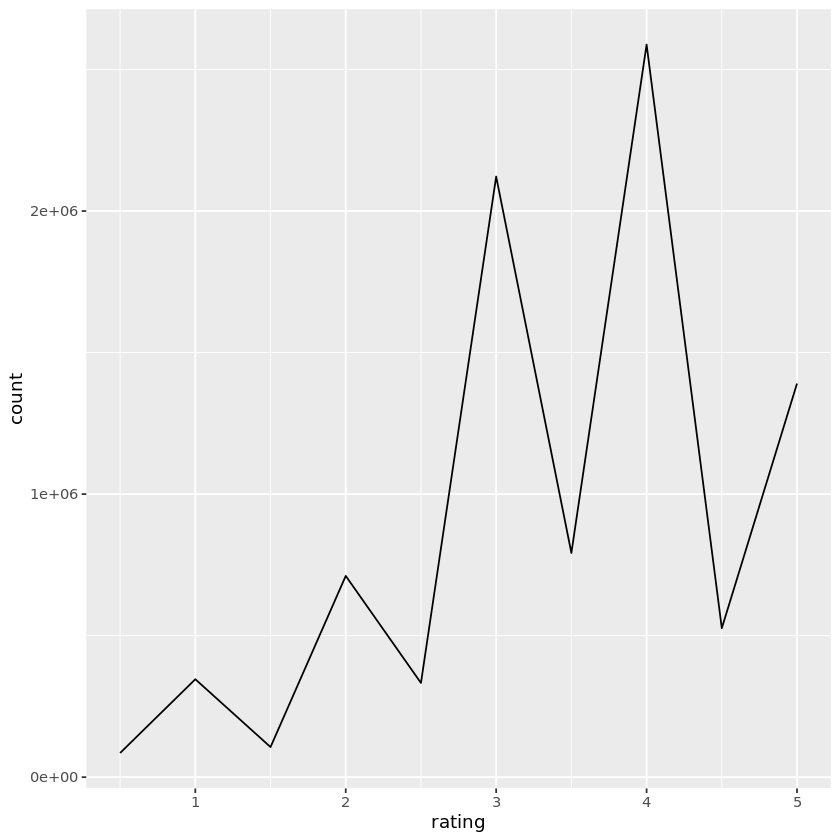
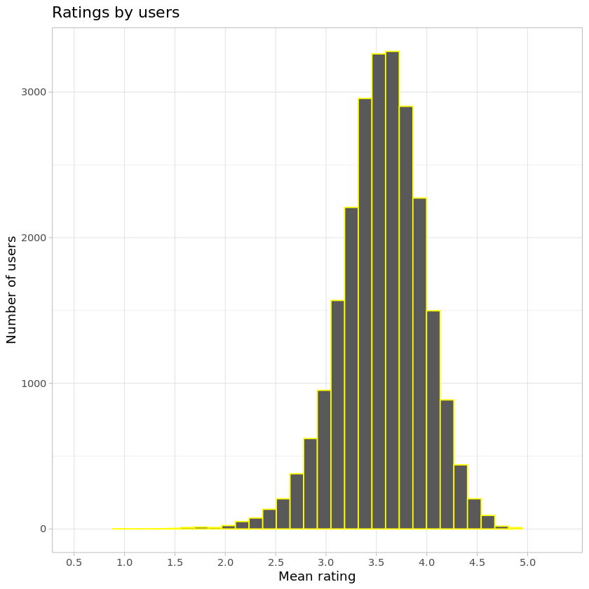
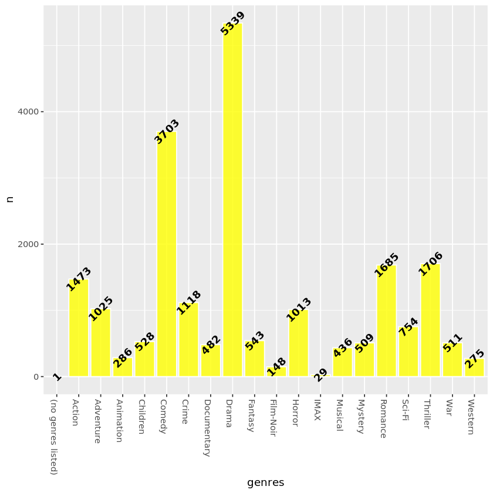
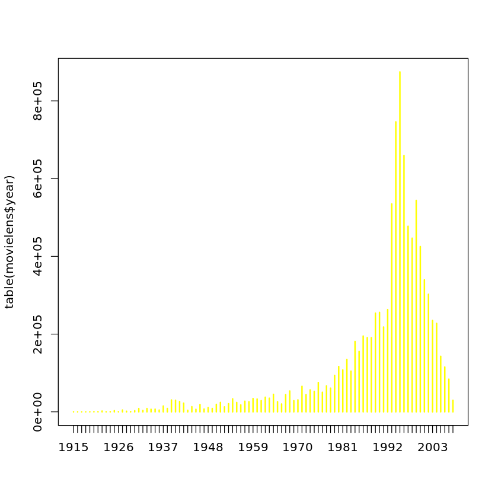
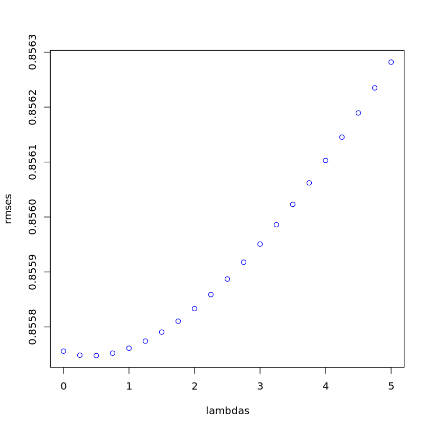
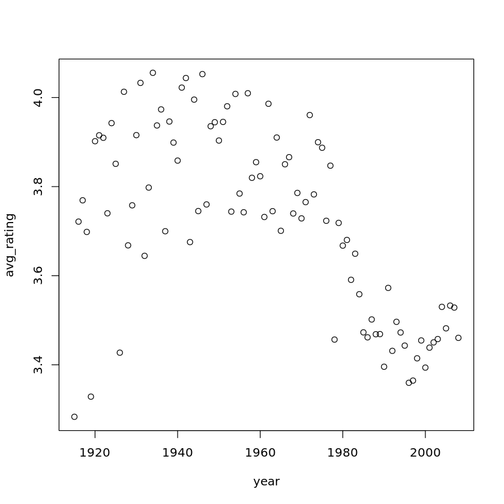

Movie Lens Data Set Recommendation Analysis
===========================================

Title: Movielens

Author : Monica Bustamante

Date:

Output: PDF

INTRODUCTION
============

Predict the rating of movies by users using ratings that have been
collected for several years by Movilens and thus convert them to
algorithms and machine learning models, and then recommend users in
their future searches, as a result, verify the performance of
algorithms. For the evaluation, the residual mean square error (RMSE) of
the predictions will be used and thus compare the real rating of the
users. In general, the algorithms and model will show a deep
understanding of the variables, observations, and ratings given by
users, and as a result, compare the final results and predictions.

1.  Create Edx Set, validation set
2.  Install Packages
3.  Install Libraries
4.  Load Data set from HTTP
5.  Create Rating
6.  Split data
7.  Create DataFrame
8.  Create validation set
9.  Analysis of the variables
10. Model Developing Approach

Install Packages and Libraries
------------------------------

.. code:: r

    #Install packages
    install.packages("tidyverse", repos = "http://cran.us.r-project.org")

.. parsed-literal::

    Updating HTML index of packages in '.Library'
    Making 'packages.html' ... done

.. code:: r

    #Install packages caret
    install.packages("caret", repos = "http://cran.us.r-project.org")

.. parsed-literal::

    Updating HTML index of packages in '.Library'
    Making 'packages.html' ... done

.. code:: r

    #Install packages 
    install.packages("data.table", repos = "http://cran.us.r-project.org")

.. parsed-literal::

    Updating HTML index of packages in '.Library'
    Making 'packages.html' ... done

.. code:: r

    #Install library
    library(tidyverse)
    library(caret)

.. parsed-literal::

    ── Attaching packages ─────────────────────────────────────── tidyverse 1.3.0 ──
    ✔ ggplot2 3.3.3     ✔ purrr   0.3.4
    ✔ tibble  3.1.0     ✔ dplyr   1.0.5
    ✔ tidyr   1.1.3     ✔ stringr 1.4.0
    ✔ readr   1.3.1     ✔ forcats 0.4.0
    ── Conflicts ────────────────────────────────────────── tidyverse_conflicts() ──
    ✖ dplyr::filter() masks stats::filter()
    ✖ dplyr::lag()    masks stats::lag()
    Loading required package: lattice
    
    Attaching package: ‘caret’
    
    The following object is masked from ‘package:purrr’:
    
        lift
    

Load DataSet
------------

.. code:: r

    #download data set Movielens
    dl <- tempfile()
     download.file("http://files.grouplens.org/datasets/movielens/ml-10m.zip", dl)

.. code:: r

    #Read table
    ratings <- read.table(text = gsub("::", "\t", readLines(unzip(dl, "ml-10M100K/ratings.dat"))),
                          col.names = c("userId", "movieId", "rating", "timestamp"))

.. code:: r

    #Split dataset
    movies <- str_split_fixed(readLines(unzip(dl, "ml-10M100K/movies.dat")), "\\::", 3)
    colnames(movies) <- c("movieId", "title", "genres")

.. code:: r

    #Mutate, rename title
    movies <- as.data.frame(movies) %>% mutate(movieId = as.numeric(levels(movieId))[movieId],
                                                title = as.character(title),
                                                genres = as.character(genres))

.. code:: r

    movielens <- left_join(ratings, movies, by = "movieId")

.. code:: r

    # Validation set will be 10% of MovieLens data
    set.seed(1)
    
    # if using R 3.5 or earlier, use `set.seed(1)` instead
    test_index <- createDataPartition(y = movielens$rating, times = 1, p = 0.1, list = FALSE)
     edx <- movielens[-test_index,]
     temp <- movielens[test_index,]

.. code:: r

    # Make sure userId and movieId in validation set are also in edx set
    validation <- temp %>% 
          semi_join(edx, by = "movieId") %>%
          semi_join(edx, by = "userId")

.. code:: r

    # Add rows removed from validation set back into edx set
    removed <- anti_join(temp, validation)
     edx <- rbind(edx, removed)
    
    rm(dl, ratings, movies, test_index, temp, movielens, removed)

.. parsed-literal::

    Joining, by = c("userId", "movieId", "rating", "timestamp", "title", "genres")

.. code:: r

    #validation dataset
    validation  <- validation %>% select(-rating)

Analysis Approach
=================

Acquire information by exploring and analyzing the dataset,
understanding the effects of the different variables.

How many rows and columns are there in the edx dataset?
=======================================================

.. code:: r

    #To see more information about the dataset
    head(edx, 5)

.. raw:: html

    <table>
    <thead><tr><th scope=col>userId</th><th scope=col>movieId</th><th scope=col>rating</th><th scope=col>timestamp</th><th scope=col>title</th><th scope=col>genres</th></tr></thead>
    <tbody>
    	<tr><td>1                           </td><td>122                         </td><td>5                           </td><td>838985046                   </td><td>Boomerang (1992)            </td><td>Comedy|Romance              </td></tr>
    	<tr><td>1                           </td><td>185                         </td><td>5                           </td><td>838983525                   </td><td>Net, The (1995)             </td><td>Action|Crime|Thriller       </td></tr>
    	<tr><td>1                                                                   </td><td>231                                                                 </td><td>5                                                                   </td><td>838983392                                                           </td><td>Dumb &amp; Dumber (1994)                                            </td><td>Comedy                      </td></tr>
    	<tr><td>1                           </td><td>292                         </td><td>5                           </td><td>838983421                   </td><td>Outbreak (1995)             </td><td>Action|Drama|Sci-Fi|Thriller</td></tr>
    	<tr><td>1                           </td><td>316                         </td><td>5                           </td><td>838983392                   </td><td>Stargate (1994)             </td><td>Action|Adventure|Sci-Fi     </td></tr>
    </tbody>
    </table>

.. code:: r

    #General information about dataset
    summary(edx)

.. parsed-literal::

         userId         movieId          rating        timestamp        
     Min.   :    1   Min.   :    1   Min.   :0.500   Min.   :7.897e+08  
     1st Qu.:18122   1st Qu.:  648   1st Qu.:3.000   1st Qu.:9.468e+08  
     Median :35743   Median : 1834   Median :4.000   Median :1.035e+09  
     Mean   :35869   Mean   : 4120   Mean   :3.512   Mean   :1.033e+09  
     3rd Qu.:53602   3rd Qu.: 3624   3rd Qu.:4.000   3rd Qu.:1.127e+09  
     Max.   :71567   Max.   :65133   Max.   :5.000   Max.   :1.231e+09  
        title              genres         
     Length:9000061     Length:9000061    
     Class :character   Class :character  
     Mode  :character   Mode  :character  
                                          
                                          
                                          

The edx data has 9,000,055 rows or observations and 6 columns or
variables. 69,878 users rated one, 797 genres, and more of the 10,677
movies. Each row represents one user’s rating to a single movie.

.. code:: r

    #How many rows and columns are there in the edx dataset
    paste('The edx dataset has',nrow(edx),'rows and',ncol(edx),'columns.')

.. raw:: html

    'The edx dataset has 9000061 rows and 6 columns.'

.. code:: r

    #To see more information about dataset
    edx %>% summarise(
      uniq_movies = n_distinct(movieId),
      uniq_users = n_distinct(userId),
      uniq_genres = n_distinct(genres))

.. raw:: html

    <table>
    <thead><tr><th scope=col>uniq_movies</th><th scope=col>uniq_users</th><th scope=col>uniq_genres</th></tr></thead>
    <tbody>
    	<tr><td>10677</td><td>69878</td><td>797  </td></tr>
    </tbody>
    </table>

.. code:: r

    #Mean or average of rating dataset
    rating_mean <- mean(edx$rating)
    rating_mean

.. raw:: html

    3.51246397107753

How many zeros were given as ratings in the edx dataset?
========================================================

.. code:: r

    #How many zeros were given as ratings in the edx dataset.
    paste(sum(edx$rating == 0), 'ratings with 0 were given and',
          sum(edx$rating == 3),'ratings with 3')

.. raw:: html

    '0 ratings with 0 were given and 2121638 ratings with 3'

.. code:: r

    edx %>% filter(rating == 3) %>% tally()

.. raw:: html

    <table>
    <thead><tr><th scope=col>n</th></tr></thead>
    <tbody>
    	<tr><td>2121638</td></tr>
    </tbody>
    </table>

How many different movies are in the edx dataset?
=================================================

.. code:: r

    #How many different movies are in the edx dataset
    n_distinct(edx$movieId)

.. raw:: html

    10677

.. code:: r

    edx %>% summarize(n_movies = n_distinct(movieId))

.. raw:: html

    <table>
    <thead><tr><th scope=col>n_movies</th></tr></thead>
    <tbody>
    	<tr><td>10677</td></tr>
    </tbody>
    </table>

How many different users are in the edx dataset?
================================================

.. code:: r

    #How many different users are in the edx dataset. n_distinct or lenght
    n_distinct(edx$userId)

.. raw:: html

    69878

.. code:: r

    edx %>% summarize(n_users = n_distinct(userId))

.. raw:: html

    <table>
    <thead><tr><th scope=col>n_users</th></tr></thead>
    <tbody>
    	<tr><td>69878</td></tr>
    </tbody>
    </table>

How many movie ratings are in each of the following genres in the edx dataset?
==============================================================================

.. code:: r

    edx %>% group_by(genres) %>% 
      summarise(n=n()) %>%
      head()

.. raw:: html

    <table>
    <thead><tr><th scope=col>genres</th><th scope=col>n</th></tr></thead>
    <tbody>
    	<tr><td>(no genres listed)                                </td><td>    6                                             </td></tr>
    	<tr><td>Action                                            </td><td>24575                                             </td></tr>
    	<tr><td>Action|Adventure                                  </td><td>68611                                             </td></tr>
    	<tr><td>Action|Adventure|Animation|Children|Comedy        </td><td> 7438                                             </td></tr>
    	<tr><td>Action|Adventure|Animation|Children|Comedy|Fantasy</td><td>  191                                             </td></tr>
    	<tr><td>Action|Adventure|Animation|Children|Comedy|IMAX   </td><td>   62                                             </td></tr>
    </tbody>
    </table>

.. code:: r

    # str_detect
    genres = c("Drama", "Comedy", "Thriller", "Romance")
    sapply(genres, function(g) {
        sum(str_detect(edx$genres, g))
    })
              
    # separate_rows, much slower!
    edx %>% separate_rows(genres, sep = "\\|") %>%
        group_by(genres) %>%
        summarize(count = n()) %>%
        arrange(desc(count))

.. raw:: html

    <dl class=dl-horizontal>
    	<dt>Drama</dt>
    		<dd>3909401</dd>
    	<dt>Comedy</dt>
    		<dd>3541284</dd>
    	<dt>Thriller</dt>
    		<dd>2325349</dd>
    	<dt>Romance</dt>
    		<dd>1712232</dd>
    </dl>

.. raw:: html

    <table>
    <thead><tr><th scope=col>genres</th><th scope=col>count</th></tr></thead>
    <tbody>
    	<tr><td>Drama             </td><td>3909401           </td></tr>
    	<tr><td>Comedy            </td><td>3541284           </td></tr>
    	<tr><td>Action            </td><td>2560649           </td></tr>
    	<tr><td>Thriller          </td><td>2325349           </td></tr>
    	<tr><td>Adventure         </td><td>1908692           </td></tr>
    	<tr><td>Romance           </td><td>1712232           </td></tr>
    	<tr><td>Sci-Fi            </td><td>1341750           </td></tr>
    	<tr><td>Crime             </td><td>1326917           </td></tr>
    	<tr><td>Fantasy           </td><td> 925624           </td></tr>
    	<tr><td>Children          </td><td> 737851           </td></tr>
    	<tr><td>Horror            </td><td> 691407           </td></tr>
    	<tr><td>Mystery           </td><td> 567865           </td></tr>
    	<tr><td>War               </td><td> 511330           </td></tr>
    	<tr><td>Animation         </td><td> 467220           </td></tr>
    	<tr><td>Musical           </td><td> 432960           </td></tr>
    	<tr><td>Western           </td><td> 189234           </td></tr>
    	<tr><td>Film-Noir         </td><td> 118394           </td></tr>
    	<tr><td>Documentary       </td><td>  93252           </td></tr>
    	<tr><td>IMAX              </td><td>   8190           </td></tr>
    	<tr><td>(no genres listed)</td><td>      6           </td></tr>
    </tbody>
    </table>

.. code:: r

    #Movie ratings by Drama. str_detect Detect The Presence Or Absence Of A Pattern In A String.
    drama <- edx %>% filter(str_detect(genres,"Drama"))
    paste('Drama has',nrow(drama),'movies')

.. raw:: html

    'Drama has 3909401 movies'

.. code:: r

    #Movie ratings by Comedy
    comedy <- edx %>% filter(str_detect(genres,"Comedy"))
    paste('Comedy has',nrow(comedy),'movies')

.. raw:: html

    'Comedy has 3541284 movies'

.. code:: r

    ##Movie ratings by Thriller
    thriller <- edx %>% filter(str_detect(genres,"Thriller"))
    paste('Thriller has',nrow(thriller),'movies')

.. raw:: html

    'Thriller has 2325349 movies'

.. code:: r

    #Movie ratings by Romance
    romance <- edx %>% filter(str_detect(genres,"Romance"))
    paste('Romance has',nrow(romance),'movies')

.. raw:: html

    'Romance has 1712232 movies'

1. VARIABLE ANALYSIS BY RATING
==============================

Find any insights to develop the recommendation model. The qualification
is the classification of the information that allows it to be evaluated
and valued based on a comparative evaluation of its standard quality or
performance, quantity, or its combination. In the Movilens data set, the
rating has a numerical ordinal scale of 0.5 to 5 stars from movie
viewers. The maximum rating they give 5 stars or less if they do not
like the movie.

Which movie has the greatest number of ratings?
===============================================

.. code:: r

    edx %>% group_by(rating) %>% 
    summarize(n=n())

.. raw:: html

    <table>
    <thead><tr><th scope=col>rating</th><th scope=col>n</th></tr></thead>
    <tbody>
    	<tr><td>0.5    </td><td>  85420</td></tr>
    	<tr><td>1.0    </td><td> 345935</td></tr>
    	<tr><td>1.5    </td><td> 106379</td></tr>
    	<tr><td>2.0    </td><td> 710998</td></tr>
    	<tr><td>2.5    </td><td> 332783</td></tr>
    	<tr><td>3.0    </td><td>2121638</td></tr>
    	<tr><td>3.5    </td><td> 792037</td></tr>
    	<tr><td>4.0    </td><td>2588021</td></tr>
    	<tr><td>4.5    </td><td> 526309</td></tr>
    	<tr><td>5.0    </td><td>1390541</td></tr>
    </tbody>
    </table>

.. code:: r

    #Greatest number of ratings. Arrange rows by variables
    edx %>% group_by(title) %>% 
    summarise(number = n()) %>% 
    arrange(desc(number))

.. raw:: html

    <table>
    <thead><tr><th scope=col>title</th><th scope=col>number</th></tr></thead>
    <tbody>
    	<tr><td>Pulp Fiction (1994)                                                           </td><td>31336                                                                         </td></tr>
    	<tr><td>Forrest Gump (1994)                                                           </td><td>31076                                                                         </td></tr>
    	<tr><td>Silence of the Lambs, The (1991)                                              </td><td>30280                                                                         </td></tr>
    	<tr><td>Jurassic Park (1993)                                                          </td><td>29291                                                                         </td></tr>
    	<tr><td>Shawshank Redemption, The (1994)                                              </td><td>27988                                                                         </td></tr>
    	<tr><td>Braveheart (1995)                                                             </td><td>26258                                                                         </td></tr>
    	<tr><td>Terminator 2: Judgment Day (1991)                                             </td><td>26115                                                                         </td></tr>
    	<tr><td>Fugitive, The (1993)                                                          </td><td>26050                                                                         </td></tr>
    	<tr><td>Star Wars: Episode IV - A New Hope (a.k.a. Star Wars) (1977)                  </td><td>25809                                                                         </td></tr>
    	<tr><td>Batman (1989)                                                                 </td><td>24343                                                                         </td></tr>
    	<tr><td>Apollo 13 (1995)                                                              </td><td>24277                                                                         </td></tr>
    	<tr><td>Toy Story (1995)                                                              </td><td>23826                                                                         </td></tr>
    	<tr><td>Independence Day (a.k.a. ID4) (1996)                                          </td><td>23360                                                                         </td></tr>
    	<tr><td>Dances with Wolves (1990)                                                     </td><td>23312                                                                         </td></tr>
    	<tr><td>Schindler's List (1993)                                                       </td><td>23234                                                                         </td></tr>
    	<tr><td>True Lies (1994)                                                              </td><td>22786                                                                         </td></tr>
    	<tr><td>Star Wars: Episode VI - Return of the Jedi (1983)                             </td><td>22629                                                                         </td></tr>
    	<tr><td>12 Monkeys (Twelve Monkeys) (1995)                                            </td><td>21959                                                                         </td></tr>
    	<tr><td>Usual Suspects, The (1995)                                                    </td><td>21533                                                                         </td></tr>
    	<tr><td>Speed (1994)                                                                  </td><td>21384                                                                         </td></tr>
    	<tr><td>Fargo (1996)                                                                  </td><td>21370                                                                         </td></tr>
    	<tr><td>Aladdin (1992)                                                                </td><td>21214                                                                         </td></tr>
    	<tr><td>Matrix, The (1999)                                                            </td><td>20894                                                                         </td></tr>
    	<tr><td>Star Wars: Episode V - The Empire Strikes Back (1980)                         </td><td>20836                                                                         </td></tr>
    	<tr><td>Seven (a.k.a. Se7en) (1995)                                                   </td><td>20271                                                                         </td></tr>
    	<tr><td>American Beauty (1999)                                                        </td><td>19859                                                                         </td></tr>
    	<tr><td>Raiders of the Lost Ark (Indiana Jones and the Raiders of the Lost Ark) (1981)</td><td>19604                                                                         </td></tr>
    	<tr><td>Back to the Future (1985)                                                     </td><td>19141                                                                         </td></tr>
    	<tr><td>Mission: Impossible (1996)                                                    </td><td>18969                                                                         </td></tr>
    	<tr><td>Ace Ventura: Pet Detective (1994)                                             </td><td>18907                                                                         </td></tr>
    	<tr><td>...</td><td>...</td></tr>
    	<tr><td>Nazis Strike, The (Why We Fight, 2) (1943)           </td><td>1                                                    </td></tr>
    	<tr><td>Neil Young: Human Highway (1982)                     </td><td>1                                                    </td></tr>
    	<tr><td>Once in the Life (2000)                              </td><td>1                                                    </td></tr>
    	<tr><td>One Hour with You (1932)                             </td><td>1                                                    </td></tr>
    	<tr><td>Part of the Weekend Never Dies (2008)                </td><td>1                                                    </td></tr>
    	<tr><td>Please Vote for Me (2007)                            </td><td>1                                                    </td></tr>
    	<tr><td>Prelude to War (Why We Fight, 1) (1943)              </td><td>1                                                    </td></tr>
    	<tr><td>Prisoner of Paradise (2002)                          </td><td>1                                                    </td></tr>
    	<tr><td>Quiet City (2007)                                    </td><td>1                                                    </td></tr>
    	<tr><td>Relative Strangers (2006)                            </td><td>1                                                    </td></tr>
    	<tr><td>Revenge of the Ninja (1983)                          </td><td>1                                                    </td></tr>
    	<tr><td>Ring of Darkness (2004)                              </td><td>1                                                    </td></tr>
    	<tr><td>Rockin' in the Rockies (1945)                        </td><td>1                                                    </td></tr>
    	<tr><td>Säg att du älskar mig (2006)                         </td><td>1                                                    </td></tr>
    	<tr><td>Shadows of Forgotten Ancestors (1964)                </td><td>1                                                    </td></tr>
    	<tr><td>Splinter (2008)                                      </td><td>1                                                    </td></tr>
    	<tr><td>Spooky House (2000)                                  </td><td>1                                                    </td></tr>
    	<tr><td>Stacy's Knights (1982)                               </td><td>1                                                    </td></tr>
    	<tr><td>Sun Alley (Sonnenallee) (1999)                       </td><td>1                                                    </td></tr>
    	<tr><td>Symbiopsychotaxiplasm: Take One (1968)               </td><td>1                                                    </td></tr>
    	<tr><td>Testament of Orpheus, The (Testament d'Orphée) (1960)</td><td>1                                                    </td></tr>
    	<tr><td>Thérèse (2004)                                       </td><td>1                                                    </td></tr>
    	<tr><td>Tokyo! (2008)                                        </td><td>1                                                    </td></tr>
    	<tr><td>Train Ride to Hollywood (1978)                       </td><td>1                                                    </td></tr>
    	<tr><td>Variety Lights (Luci del varietà) (1950)             </td><td>1                                                    </td></tr>
    	<tr><td>Where A Good Man Goes (Joi gin a long) (1999)        </td><td>1                                                    </td></tr>
    	<tr><td>Wings of Eagles, The (1957)                          </td><td>1                                                    </td></tr>
    	<tr><td>Women of the Night (Yoru no onnatachi) (1948)        </td><td>1                                                    </td></tr>
    	<tr><td>Won't Anybody Listen? (2000)                         </td><td>1                                                    </td></tr>
    	<tr><td>Zona Zamfirova (2002)                                </td><td>1                                                    </td></tr>
    </tbody>
    </table>

.. code:: r

    head(sort(-table(edx$rating)), 5)
    hist(edx$rating)
    summary(edx$rating)

.. parsed-literal::

    
           4        3        5      3.5        2 
    -2588021 -2121638 -1390541  -792037  -710998 

.. parsed-literal::

       Min. 1st Qu.  Median    Mean 3rd Qu.    Max. 
      0.500   3.000   4.000   3.512   4.000   5.000 

.. code:: r

    edx %>%  # Ratings Distribution:
      ggplot(aes(rating)) +
      geom_histogram(binwidth = 0.15, color = "yellow") +
      scale_x_discrete(limits = c(seq(0.5,5,0.5))) +
      scale_y_continuous(breaks = c(seq(0, 3000000, 500000))) +
      ggtitle("Graphic Rating Distribution")

.. parsed-literal::

    Warning message:
    “Continuous limits supplied to discrete scale.
    Did you mean `limits = factor(...)` or `scale_*_continuous()`?”

What are the five most given ratings in order from most to least?
=================================================================

.. code:: r

    #Sort a variable in descending order.
    edx %>% group_by(rating) %>% 
    summarize(count = n()) %>% 
    top_n(5) %>%
    arrange(desc(count))

.. parsed-literal::

    Selecting by count

.. raw:: html

    <table>
    <thead><tr><th scope=col>rating</th><th scope=col>count</th></tr></thead>
    <tbody>
    	<tr><td>4.0    </td><td>2588021</td></tr>
    	<tr><td>3.0    </td><td>2121638</td></tr>
    	<tr><td>5.0    </td><td>1390541</td></tr>
    	<tr><td>3.5    </td><td> 792037</td></tr>
    	<tr><td>2.0    </td><td> 710998</td></tr>
    </tbody>
    </table>

True or False: In general, half star ratings are less common than whole star ratings (e.g., there are fewer ratings of 3.5 than there are ratings of 3 or 4, etc.).
===================================================================================================================================================================

.. code:: r

    #Rating movies
    rating4 <- table(edx$rating)["4"]
    rating35 <- table(edx$rating)["3.5"]
    rating3 <- table(edx$rating)["3"]
    
    Result <- (rating35 < rating3 && rating35 < rating4)
    
    print(Result)
    
    rm(rating35, rating3, rating4, Result)

.. parsed-literal::

    [1] TRUE

.. code:: r

    #Graphic Rating movies
    edx %>%
    	group_by(rating) %>%
    	summarize(count = n()) %>%
    	ggplot(aes(x = rating, y = count)) +
    	geom_line()

.. code:: r

    # Plot mean movie ratings given by users
    edx %>%
      group_by(userId) %>%
      filter(n() >= 100) %>%
      summarize(b_u = mean(rating)) %>%
      ggplot(aes(b_u)) +
      geom_histogram(bins = 30, color = "yellow") +
      xlab("Mean rating") +
      ylab("Number of users") +
      ggtitle("Ratings by users") +
      scale_x_discrete(limits = c(seq(0.5,5,0.5))) +
      theme_light()

.. parsed-literal::

    Warning message:
    “Continuous limits supplied to discrete scale.
    Did you mean `limits = factor(...)` or `scale_*_continuous()`?”

4. MODELING
===========

Predicted movie ratings and calculates RMSE.
============================================

Movie rating predictions will be compared to the true ratings in the
validation set using RMSE

.. code:: r

    list.of.packages <- c("tidyverse", "caret","tidyr","stringr","ggplot2","readr","lubridate","stringi","lattice")
    new.packages <- list.of.packages[!(list.of.packages %in% installed.packages()[,"Package"])]
    if(length(new.packages)) install.packages(new.packages)
    library(tidyverse)
    library(caret)
    library(tidyr)
    library(stringr)
    library(ggplot2)
    library(readr)
    library(lubridate)
    library(stringi)

.. parsed-literal::

    
    Attaching package: ‘lubridate’
    
    The following object is masked from ‘package:base’:
    
        date
    

.. code:: r

    dl <- tempfile()
    download.file("http://files.grouplens.org/datasets/movielens/ml-10m.zip", dl)

.. code:: r

    ratings <- read.table(text = gsub("::", "\t", readLines(unzip(dl, "ml-10M100K/ratings.dat"))),
                          col.names = c("userId", "movieId", "rating", "timestamp"))

.. code:: r

    movies <- str_split_fixed(readLines(unzip(dl, "ml-10M100K/movies.dat")), "\\::", 3)
    colnames(movies) <- c("movieId", "title", "genres")
    
    movies <- as.data.frame(movies) %>% mutate(movieId = as.numeric(levels(movieId))[movieId],
                                               title = as.character(title),
                                               genres = as.character(genres))
    
    movielens <- left_join(ratings, movies, by = "movieId")
    ratings <- read.table(text = gsub("::", "\t", readLines(unzip(dl, "ml-10M100K/ratings.dat"))),
                          col.names = c("userId", "movieId", "rating", "timestamp"))
                          
    dat <- movies %>% separate_rows(genres, sep ="\\|")
    DAT.aggregate <- aggregate(formula = cbind(n = 1:nrow(dat)) ~ genres, data = dat, FUN = length)

.. code:: r

    #Size of dataset 
    movielens <- left_join(ratings, movies, by = "movieId")
    nrow(movielens)

.. raw:: html

    10000054

.. code:: r

    #Gender as Drama and Comedy have high rating.
    
    ggplot(DAT.aggregate,aes(x=genres,y=n))+
        geom_col(group="genres",alpha=0.8,fill ="yellow", color="white")+
        geom_text(label=DAT.aggregate$n,angle=45,fontface = "bold")+
    theme(axis.text.x=element_text(angle = -90, hjust = 0))

.. code:: r

    #Movies from the 1980s to 1990s and older have higher average ratings than recent movies.
    
    movielens$year <- as.numeric(substr(as.character(movielens$title),
                      nchar(as.character(movielens$title))-4,
                      nchar(as.character(movielens$title))-1))
    plot(table(movielens$year),
        col = "yellow")

Model Approach
==============

Movilens is a very large database with different variables that have
different effects on ratings. Genres have a significant effect on
ratings, it is required to divide compound genres into individual genres
and calculate the effect of each genre using relatively more complex
calculations. Some movies have a very high number of ratings, while
others have very few or low ratings. Coming from small samples -few
numbers of grades- can adversely affect preaching. we will use a method
known as Regularization to penalize of very high or low grades that come
from small samples. Also, we will divide the edx dataset into two parts:
train (80%) and test (20%), then we will use train to train the model
and test to cross-validate and fit the model to get the best lambda
value that results in a minimum RMSE.

.. code:: r

    #Validation set will be 10% of the movieLens data
    set.seed(2) #Partition dataset test and train
    test_index <- createDataPartition(y = edx$rating, times = 2, p = 0.1, list = FALSE)
    edx <- edx[-test_index,] #train set
    temp <- edx[test_index,] 

.. code:: r

    edx <- edx %>% # It extracts the release year of the movie and creates `year` column.
      mutate(title = str_trim(title)) %>%
      extract(title, c("title_tmp", "year"),
              regex = "^(.*) \\(([0-9 \\-]*)\\)$",
              remove = F) %>%
      mutate(year = if_else(str_length(year) > 4,
                            as.integer(str_split(year, "-",
                                                 simplify = T)[1]),
                            as.integer(year))) %>%
      mutate(title = if_else(is.na(title_tmp), title, title_tmp)) %>%
      select(-title_tmp)  %>%
      mutate(genres = if_else(genres == "(no genres listed)",
                              `is.na<-`(genres), genres))
    validation <- temp %>% 
      semi_join(edx, by = "movieId") %>%
      semi_join(edx, by = "userId")

.. code:: r

    #Root Mean Square Error Loss Function
    RMSE <- function(true_ratings, predicted_ratings){
            sqrt(mean((true_ratings - predicted_ratings)^2))
          }
          
    lambdas <- seq(0, 5, 0.25)
    rmses <- sapply(lambdas,function(l){
      
      #Mean of ratings from the edx training set
      mu <- mean(edx$rating)
      
      #Adjust mean by movie effect and penalize low number on ratings
      b_i <- edx %>% 
        group_by(movieId) %>%
        summarize(b_i = sum(rating - mu)/(n()+l))
      
      #Adjdust mean by user and movie effect and penalize low number of ratings
      b_u <- edx %>% 
        left_join(b_i, by="movieId") %>%
        group_by(userId) %>%
        summarize(b_u = sum(rating - b_i - mu)/(n()+l))
      
      #Predict ratings in the training set to derive optimal penalty value 'lambda'
      predicted_ratings <- 
        edx %>% 
        left_join(b_i, by = "movieId") %>%
        left_join(b_u, by = "userId") %>%
        mutate(pred = mu + b_i + b_u) %>%
        .$pred
      
      return(RMSE(predicted_ratings, edx$rating))
    })
    plot(lambdas, rmses,
        col = "blue")

.. code:: r

    movie_avgs <- edx

.. code:: r

    lambda <- lambdas[which.min(rmses)]
    paste('Optimal RMSE of',min(rmses),'is achieved with Lambda',lambda)

.. raw:: html

    'Optimal RMSE of 0.85574776502364 is achieved with Lambda 0.5'

.. code:: r

    lambda <- 0.5
          
    pred_y_lse <- sapply(lambda,function(l){
      
      #Derive the mearn from the training set
      mu <- mean(edx$rating)
      
      #Calculate movie effect with optimal lambda
    b_i <- edx %>% 
        group_by(movieId) %>%
        summarize(b_i = sum(rating - mu)/(n()+l))
      
      #Calculate user effect with optimal lambda
    b_u <- edx %>% 
        left_join(b_i, by="movieId") %>%
        group_by(userId) %>%
        summarize(b_u = sum(rating - b_i - mu)/(n()+l))
      
      #Predict ratings on validation set
    predicted_ratings <- 
        validation %>% 
        left_join(b_i, by = "movieId") %>%
        left_join(b_u, by = "userId") %>%
        mutate(pred = mu + b_i + b_u) %>%
        .$pred #validation
      
      return(predicted_ratings)
      
    })

.. code:: r

    avg_ratings <- edx %>% 
    group_by(year) %>% 
    summarise(avg_rating = mean(rating))
    plot(avg_ratings)

.. code:: r

    library(lubridate)
    
    tibble(`Initial Date` = date(as_datetime(min(edx$timestamp), origin="1990-01-01")),
           `Final Date` = date(as_datetime(max(edx$timestamp), origin="1990-01-01"))) %>%
      mutate(Period = duration(max(edx$timestamp)-min(edx$timestamp)))

.. raw:: html

    <table>
    <thead><tr><th scope=col>Initial Date</th><th scope=col>Final Date</th><th scope=col>Period</th></tr></thead>
    <tbody>
    	<tr><td>2015-01-09               </td><td>2029-01-05               </td><td>441479128s (~13.99 years)</td></tr>
    </tbody>
    </table>

.. code:: r

    edx %>% mutate(date = date(as_datetime(timestamp, origin="1990-01-01"))) %>%
      group_by(date, title) %>%
      summarise(count = n()) %>%
      arrange(-count) %>%
      head(10)

.. parsed-literal::

    `summarise()` has grouped output by 'date'. You can override using the `.groups` argument.

.. raw:: html

    <table>
    <thead><tr><th scope=col>date</th><th scope=col>title</th><th scope=col>count</th></tr></thead>
    <tbody>
    	<tr><td>2018-05-22                                           </td><td>Chasing Amy                                          </td><td>266                                                  </td></tr>
    	<tr><td>2020-11-20                                           </td><td>American Beauty                                      </td><td>215                                                  </td></tr>
    	<tr><td>2019-12-11                                           </td><td>Star Wars: Episode IV - A New Hope (a.k.a. Star Wars)</td><td>202                                                  </td></tr>
    	<tr><td>2019-12-11                                           </td><td>Star Wars: Episode V - The Empire Strikes Back       </td><td>200                                                  </td></tr>
    	<tr><td>2025-03-22                                           </td><td>Lord of the Rings: The Two Towers, The               </td><td>197                                                  </td></tr>
    	<tr><td>2019-12-11                                           </td><td>Star Wars: Episode VI - Return of the Jedi           </td><td>189                                                  </td></tr>
    	<tr><td>2025-03-22                                           </td><td>Lord of the Rings: The Fellowship of the Ring, The   </td><td>177                                                  </td></tr>
    	<tr><td>2020-11-20                                           </td><td>Jurassic Park                                        </td><td>173                                                  </td></tr>
    	<tr><td>2020-11-20                                           </td><td>Terminator 2: Judgment Day                           </td><td>170                                                  </td></tr>
    	<tr><td>2019-12-11                                           </td><td>Matrix, The                                          </td><td>169                                                  </td></tr>
    </tbody>
    </table>

CONCLUSION
==========

RMSE, root-mean-square deviation, model that was used to predict from a
list of rated movies, and discovers patterns. It was determined which
movies viewers prefer, with a medium to high rating. (3 to 5). The films
preferred by the clients were those produced from the periods 1980 and
1990 with a maximum rating of 4. The model yielded an accuracy of 85%,
highlighting that the larger the sample size increases the accuracy or
precision of the model and vice versa.
